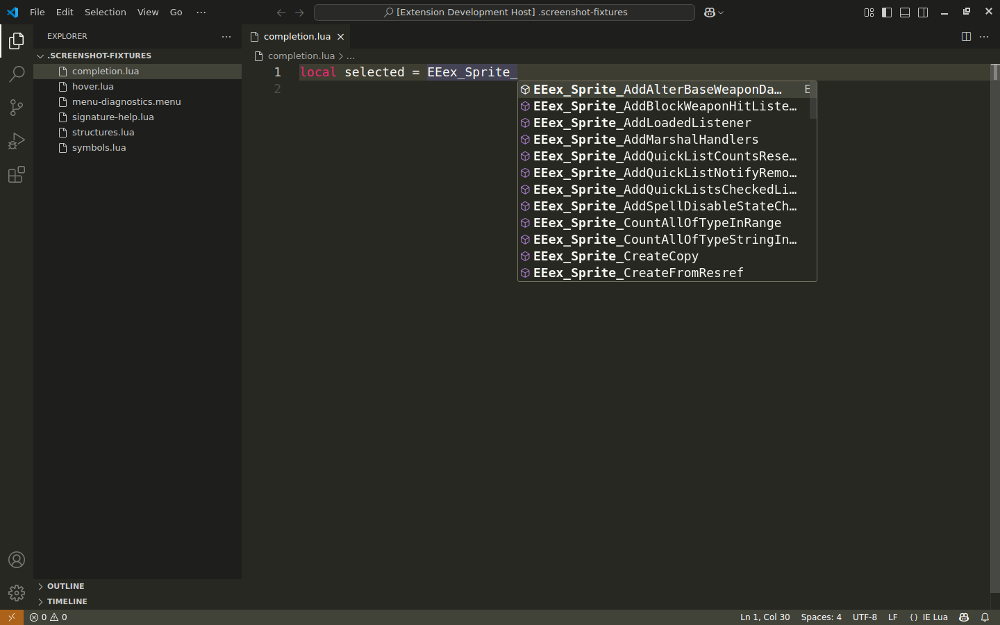
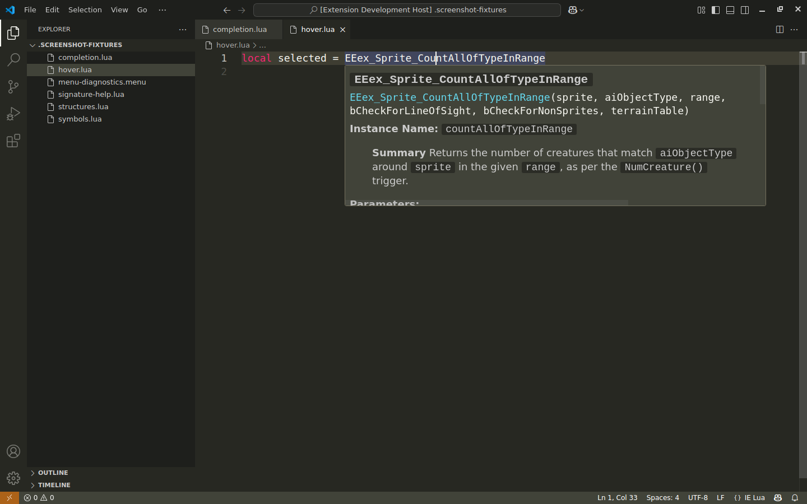
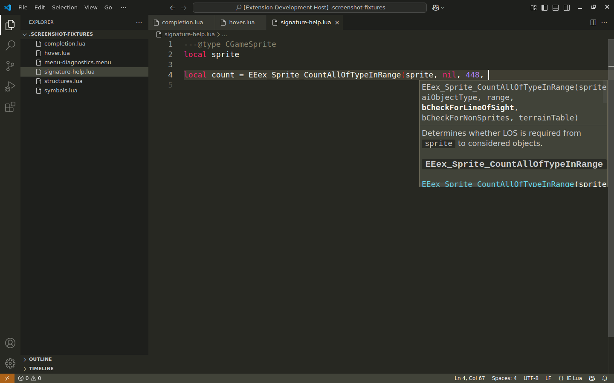
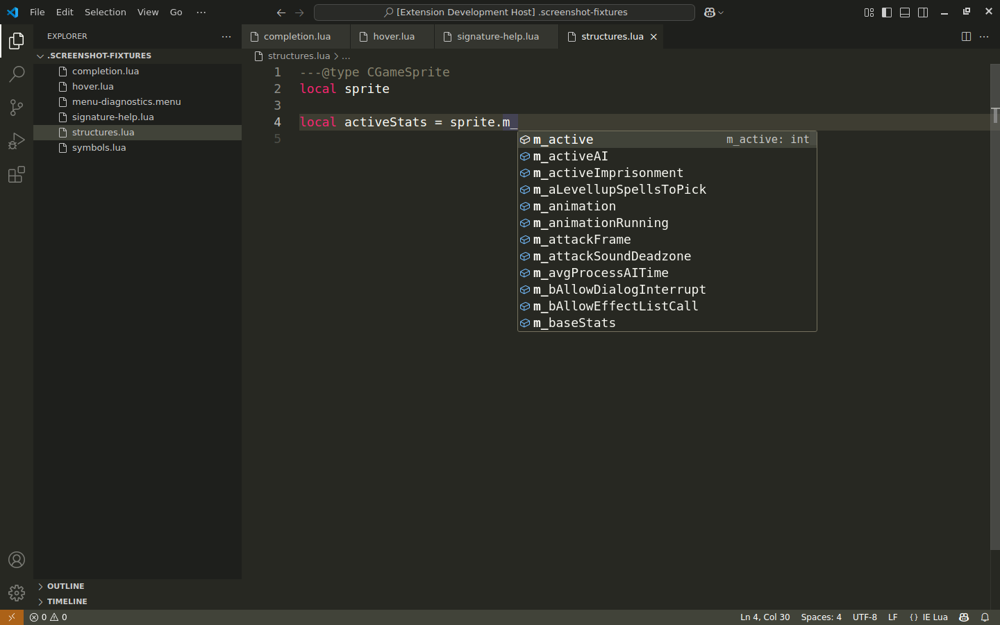
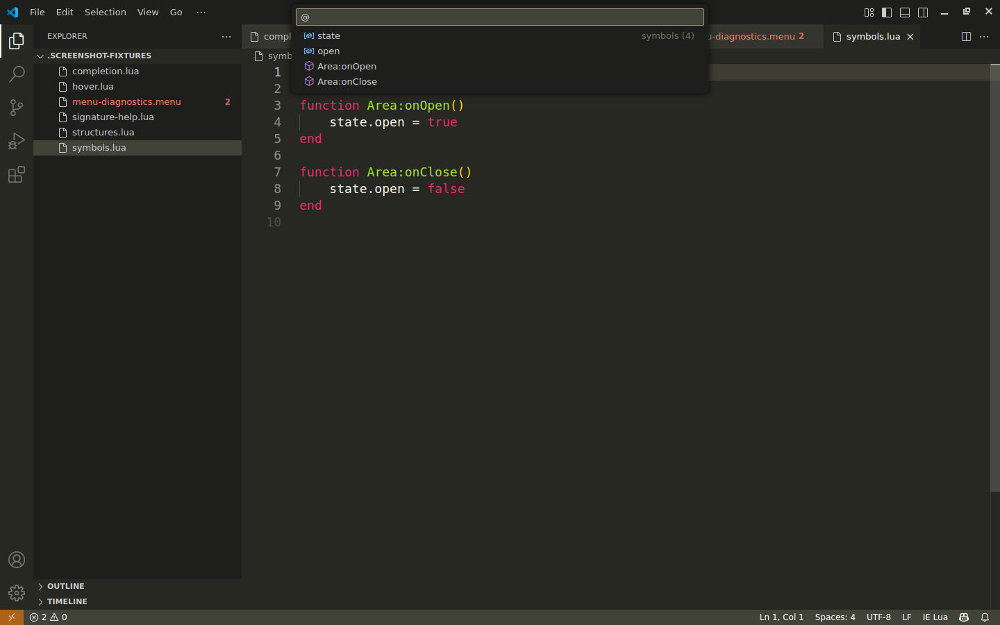

# IE Lua Language Server

[](https://github.com/4Luke4/ie-lua-language-server/actions/workflows/ci.yml)
[](https://github.com/4Luke4/ie-lua-language-server/actions/workflows/codeql.yml)
[](https://marketplace.visualstudio.com/items?itemName=infinity-engine-tools.ie-lua-language-server)
[](https://github.com/4Luke4/ie-lua-language-server/releases/latest)
[](https://github.com/4Luke4/ie-lua-language-server/releases)
[](https://github.com/4Luke4/ie-lua-language-server/releases/latest)

Professional language support for Enhanced Edition Infinity Engine Lua and `.menu` files.

This repository ships:

- A Visual Studio Code extension.
- A stdio-capable Language Server Protocol server for Sublime Text, Neovim, Emacs, JetBrains
  IDEs, Helix, Kate, Geany and any other editor with a Language Server Protocol client.

This extension targets:

- Lua 5.2 with the base globals and the `bit32`, `debug`, `math`, `string`, and `table` libraries.
- LuaJIT compatibility mode.
- Infinity Engine `.lua` files.
- Infinity Engine `.menu` files with embedded Lua regions.

## Features

- Completion, hover, signature help, go to definition, find references, same-file rename, diagnostics, formatting, document symbols, workspace symbols, semantic tokens, and folding. <!-- feature: language-services -->
- Scope-aware Lua analysis backed by a parser plus tolerant fallback scanning for incomplete buffers. <!-- feature: scope-and-fallback -->
- Embedded Lua analysis in `.menu` files for backtick chunks, `lua "..."` expressions, action/open/close/escape blocks, and `enabled`/`clickable` expressions. <!-- feature: embedded-lua -->
- Source-driven API data from official sources only, with immutable upstream provenance. <!-- feature: source-provenance -->
- Full EE Game Lua and EEex function completion, hover, signature help, and source definitions, including namespace members, colon methods, typed instance aliases, parameter defaults, return values, warnings, notes, examples, and tables. <!-- feature: function-api -->
- Full EE Game Structures (x64) layout metadata: structure and field completion, annotation-aware member resolution, members inherited from extended structures, chained field hover, exact source definitions, types, offsets, and byte sizes. <!-- feature: structure-api -->

## Stable 0.6.x contract and current limits

The prepared 0.6.0 milestone targets the stable channel. Within 0.6.x, documented setting keys,
command IDs, language IDs, and supported editor/runtime behavior remain compatible; intentional
correctness fixes are described in the changelog. Publication status is shown in GitHub Releases.

Workspace symbols and Validate Workspace cover **open documents**. Navigation and rename use
same-document lexical bindings. API-backed member completion is not general-purpose Lua type inference.

Formatting only removes trailing spaces and tabs outside Lua strings and comments. It preserves
line endings and final-newline state, protects unfinished strings/comments, and leaves `.menu`
documents unchanged. `ieLua.formatter.configPath` is retained for compatibility but currently unused;
no external formatter or workspace executable is invoked.

If API data is unavailable at startup, lexical language services remain usable with an empty API
index. Failed reloads retain the previous index and display an error. Use **IE Lua: Open Server Log**
to identify unreadable or invalid candidates, restore the data, and retry **IE Lua: Reload API Data**.
A successful reload refreshes API services immediately; diagnostics update on the next configured
validation trigger. Validate Document requires a supported active editor, including untitled documents.

The [0.6.0 release record](docs/release/0.6.0.md) describes acceptance criteria and coverage limits.

## Screenshots

The screenshots below were captured at 1440x900 from a real Visual Studio Code Extension Development Host using non-proprietary fixture snippets and Visual Studio Code's built-in **Monokai** theme. The reproducible capture steps are documented in [`docs/screenshots/README.md`](docs/screenshots/README.md).

<details>
<summary><strong>View Visual Studio Code screenshots</strong></summary>

### EEex Function Completion



### EEex Hover Documentation



### Signature Help



### EE Game Structures (x64) Member Completion



### Embedded `.menu` Diagnostics


### Document Symbols



</details>

## Runtime Dependencies

Visual Studio Code users do **not** need to install `luaparse`, Node.js, npm, or any other npm package to use validation. The published Marketplace extension and generated VSIX bundle the language server runtime dependencies.

Users of the other editors do not need `luaparse` or npm packages either, but they do need Node.js 24 LTS available on `PATH`, because those editors start the bundled server as an external stdio process.

## Using with Visual Studio Code

For Windows, macOS, and Linux:

1. Install **IE Lua Language Server** from the Visual Studio Code Marketplace, or install the generated `.vsix`.
2. Reload Visual Studio Code if prompted.
3. Open an Infinity Engine `.lua` or `.menu` file.

Settings can be changed from the Visual Studio Code Settings UI or `settings.json`:

```json
{
  "ieLua.dialect": "lua52",
  "ieLua.validation.mode": "save",
  "ieLua.validation.debounceMs": 300,
  "ieLua.diagnostics.unknownGlobals": "off"
}
```

The extension activates automatically for `.lua` and `.menu` files and exposes the commands listed below.

## Using with other editors

The same bundled server runs over stdin/stdout for editors outside Visual Studio Code. There is one
server, one API index and one set of behaviours; only the client configuration differs. Shipped
configurations and per-editor guides live in [`editors/`](editors/README.md).

| Editor         | Client             | Ships a config | Guide                                            |
| -------------- | ------------------ | -------------- | ------------------------------------------------ |
| Sublime Text   | LSP package        | yes            | [editors/sublime](editors/sublime/README.md)     |
| Neovim         | built-in `vim.lsp` | yes            | [editors/neovim](editors/neovim/README.md)       |
| Emacs          | Eglot              | yes            | [editors/emacs](editors/emacs/README.md)         |
| JetBrains IDEs | LSP4IJ             | yes            | [editors/jetbrains](editors/jetbrains/README.md) |
| Helix          | built in           | yes            | [editors/helix](editors/helix/README.md)         |
| Kate           | LSP Client plugin  | yes            | [editors/kate](editors/kate/README.md)           |
| Geany          | LSP Client plugin  | yes            | [editors/geany](editors/geany/README.md)         |
| Zed            | extension required | **no**         | [editors/zed](editors/zed/README.md)             |
| Notepad++      | third-party plugin | **no**         | [editors/notepadpp](editors/notepadpp/README.md) |

Zed registers a language server only from a compiled extension, and Notepad++ ships no LSP client at
all. Those two guides describe what each actually requires instead of offering a configuration that
would not work.

Every one of these needs Node.js 24 on `PATH` and a built server — this repository after
`npm run bundle`, or an unpacked `.vsix` — because the editor starts the server as a subprocess. The
server is invoked the same way everywhere:

```sh
node /absolute/path/to/ie-lua-language-server/dist/server/server.js --stdio
```

`.lua` documents use the `ie-lua` language id and `.menu` documents use `ie-menu`. Editors that
cannot set an id are still handled: the server recognises a `.menu` document by its file extension.

Two behaviours differ from Visual Studio Code and belong to the server rather than to any editor. Go
to Definition on an API symbol answers with the pinned upstream documentation URL rather than a file
location, so editors that cannot open a URL will report that; the same URL is always in the symbol's
hover. Workspace symbols and Validate Workspace cover open documents.

Node.js and npm are only required when building or testing this repository, or when launching the
stdio server from a non-Visual Studio Code editor.

## Validation Modes

`ieLua.validation.mode` controls when diagnostics run:

- `manual`: only through `IE Lua: Validate Document` or `IE Lua: Validate Workspace`.
- `save`: on save. This is the default.
- `type`: while editing, using the configured debounce delay.
- `saveAndType`: on save and while editing, using the configured debounce delay for edits.

`ieLua.validation.debounceMs` controls the type-validation delay in milliseconds and defaults to `300`. Lower values make diagnostics appear sooner but may increase CPU usage during rapid edits. Higher values coalesce more edits and reduce repeated validation work, but diagnostics take longer to appear.

## Commands

- `IE Lua: Validate Document`
- `IE Lua: Validate Workspace`
- `IE Lua: Reload API Data`
- `IE Lua: Show API Source`
- `IE Lua: Open Server Log`

## Development

Node.js 24 LTS and npm are required. This repository is structured as a TypeScript npm workspace.

Open a draft PR to run CI. Compilation, formatting, tests, packaging, and API generation run
exclusively in GitHub Actions. Download verified VSIX files and maintenance patches from the run.
The language server runs as a separate process over IPC from the VS Code extension client.

The docs-ingestion step reads official Lua 5.2, LuaJIT, EE Game Lua Function, and EEex Function documentation from pinned inputs and stores the source wording as Markdown for hover, completion, and signature-help previews: the Lua 5.2.4 release archive verified against its published SHA-256, and the LuaJIT and EEex-Docs repositories at fixed commits. RST and HTML presentation is converted to equivalent VS Code Markdown while paragraphs, emphasis, lists, tables, admonitions, superscripts, code blocks, typographic characters, and visible punctuation are retained, published signatures are shown verbatim, and cross-references become links to the pinned upstream location. The declared-feature suite compares representative hovers from every source byte for byte with the pinned sources and audits every shipped hover for Markdown that would render differently.

Generated API data uses a schema-v3 manifest for auditability. `resources/api/api-index.json` retains the six logical source sections and lists every data file with its symbol count and, for EE/EEex data, its exact upstream category path. The three EEex-backed sources mirror the top-level categories in the pinned upstream toctrees, including explicit empty shards:

- `resources/api/sections/ee-game-lua-functions/`
- `resources/api/sections/eeex-functions/`
- `resources/api/sections/ee-game-structures-x64/`

Lua 5.2, LuaJIT, and optional local utility metadata remain single-file sections under `resources/api/sections/`. Category filenames are derived deterministically from upstream names rather than maintained as a hardcoded list.

The Actions ingestion job sets `IE_LUA_FETCH_EEEX=1` to refresh EEex metadata. The generator resolves the latest `dev` revision by default; set `IE_LUA_EEEX_COMMIT` to a full commit SHA for a reproducible run. In Actions, `.github/actions/upstream-docs` checks out EEex-Docs and LuaJIT at their pinned commits and downloads the verified Lua archive, and the generator reads them through `IE_LUA_EEEX_DOCS_ROOT`, `IE_LUA_LUAJIT_DOCS_ROOT`, and `IE_LUA_LUA52_MANUAL` instead of calling the GitHub API. The Lua and LuaJIT pins live in `packages/tools/upstream-pins.json`. Function ingestion discovers every standalone EE Game function page, every game function defined directly in a category index, and every `EEex_*` function anchor from the pinned tree. It rejects incomplete or malformed input and records exact commit-and-line provenance. Structure help includes names, fields, types, offsets, byte sizes, upstream narrative, and pinned source lines.

The scheduled **Update EEex API data** workflow checks the upstream repository daily. When its revision changes, the workflow regenerates and verifies the API data on a dedicated branch and opens a pull request for review; it never executes upstream code.

Local game files under `samples/` are ignored because they may contain proprietary official content. Set `IE_LUA_SCAN_LOCAL_UTIL=1` only when you intentionally want an ingestion run in an approved Actions environment to derive EE Utility Function metadata from an untracked `samples/util.lua` file.

## Release Process

Stable and prerelease publishing instructions are maintained in `docs/release.md`.

CI audits both stable and prerelease VSIX files; select the intended channel in the Release workflow. The prerelease path uses VS Code's `--pre-release` flag; do not put a SemVer prerelease suffix in `package.json.version`.

## Documentation Provenance

The shipped API index is generated from these official sources:

- EE Game Lua Functions: `https://github.com/Bubb13/EEex-Docs/tree/35445db362f56095156e3b43aa8f6f0f50f728a0/source/EE%20Game%20Lua%20Functions`
- EEex Functions: `https://github.com/Bubb13/EEex-Docs/tree/35445db362f56095156e3b43aa8f6f0f50f728a0/source/EEex%20Functions`
- EE Game Structures (x64): `https://github.com/Bubb13/EEex-Docs/tree/35445db362f56095156e3b43aa8f6f0f50f728a0/source/EE%20Game%20Structures%20(x64)`
- Lua 5.2: `https://www.lua.org/ftp/lua-5.2.4.tar.gz`
- LuaJIT: `https://github.com/LuaJIT/LuaJIT/tree/c6ffc141a8762b41703f9287d63d93622a13dd8f/doc`
- EE Utility Functions: local, untracked `samples/util.lua` only when explicitly enabled for docs ingestion.

Bundled third-party documentation attribution is recorded in `THIRD_PARTY_NOTICES.md`.

## License

This project is proprietary software. See `LICENSE.md`.
