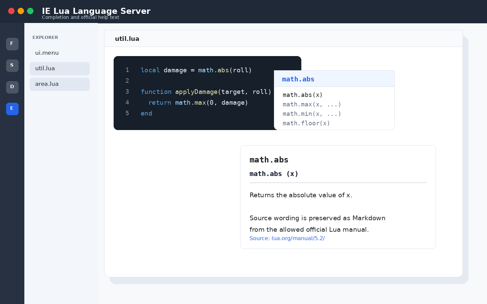
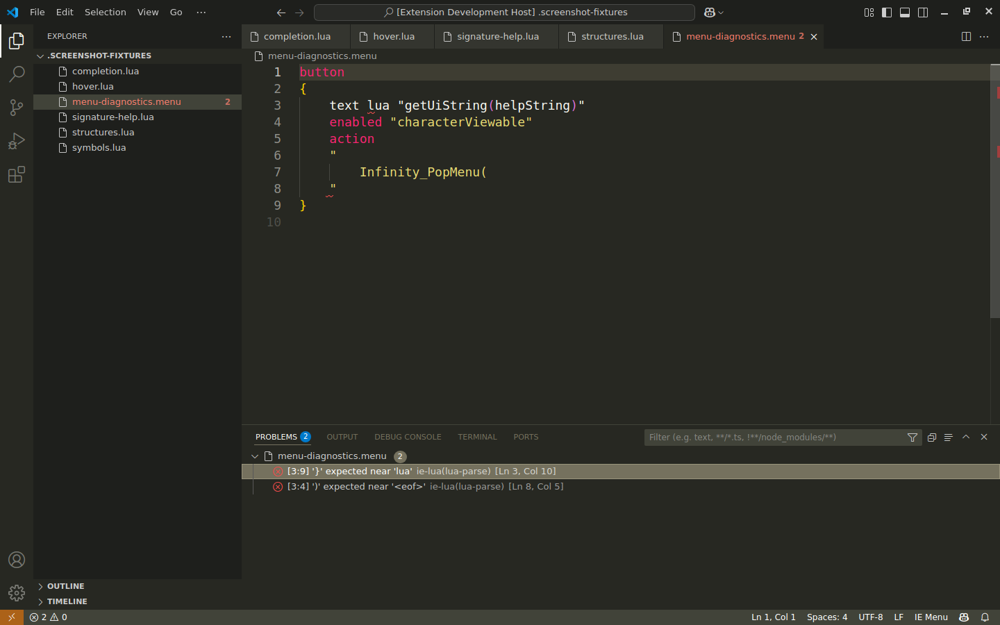
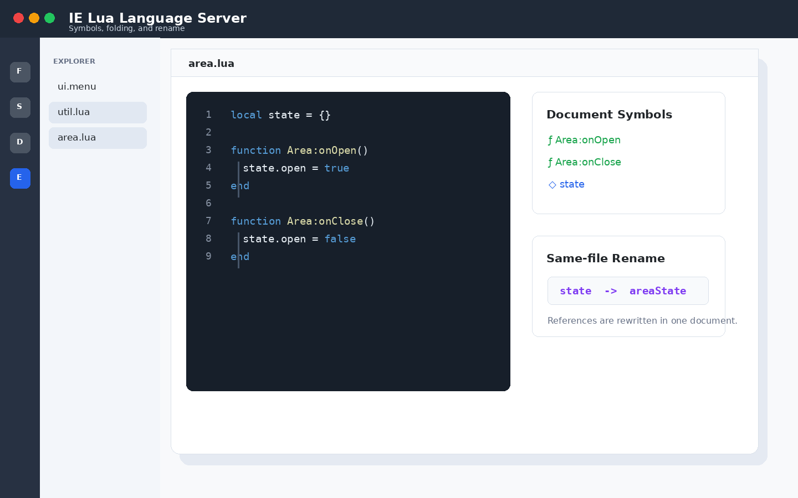
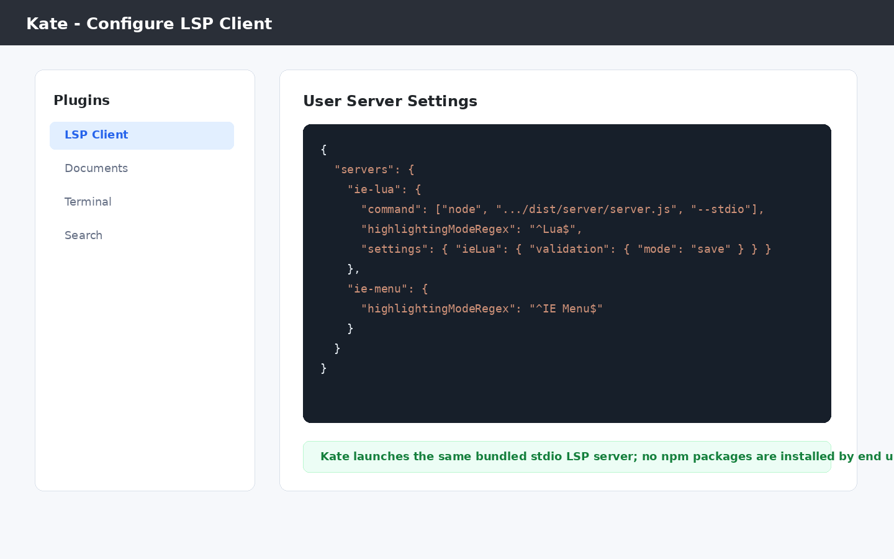

# IE Lua Language Server

Professional language support for Enhanced Edition Infinity Engine Lua and `.menu` files.

This repository ships:

- A Visual Studio Code extension.
- A stdio-capable Language Server Protocol server for editors such as Kate.

This extension targets:

- Lua 5.2 with the base globals and the `bit32`, `debug`, `math`, `string`, and `table` libraries.
- LuaJIT compatibility mode.
- Infinity Engine `.lua` files.
- Infinity Engine `.menu` files with embedded Lua regions.

## Features

- Completion, hover, signature help, go to definition, find references, same-file rename, diagnostics, formatting, document symbols, workspace symbols, semantic tokens, and folding.
- Scope-aware Lua analysis backed by a parser plus tolerant fallback scanning for incomplete buffers.
- Embedded Lua analysis in `.menu` files for backtick chunks, `lua "..."` expressions, action/open/close/escape blocks, and `enabled`/`clickable` expressions.
- Permission-gated generated API data from official sources only.

## Screenshots

The screenshots below use non-proprietary fixture snippets.

### Completion and Official Help Text



### Embedded `.menu` Diagnostics



### Symbols, Folding, and Rename



### Kate LSP Client Setup



## Runtime Dependencies

Visual Studio Code users do **not** need to install `luaparse`, Node.js, npm, or any other npm package to use validation. The published Marketplace extension and generated VSIX bundle the language server runtime dependencies.

Kate users do not need `luaparse` or npm packages, but they do need Node.js 24 LTS available on `PATH` because Kate starts the bundled server as an external stdio process.

## Using with Visual Studio Code

For Windows, macOS, and Linux:

1. Install **IE Lua Language Server** from the Visual Studio Code Marketplace, or install the generated `.vsix`.
2. Reload Visual Studio Code if prompted.
3. Open an Infinity Engine `.lua` or `.menu` file.

Settings can be changed from the Visual Studio Code Settings UI or `settings.json`:

```json
{
  "ieLua.dialect": "lua52",
  "ieLua.validation.mode": "save",
  "ieLua.diagnostics.unknownGlobals": "off"
}
```

The extension activates automatically for `.lua` and `.menu` files and exposes the commands listed below.

## Using with Kate

Kate integration uses the same bundled LSP server over stdin/stdout. This is useful when you want completion, hover, diagnostics, definitions, references, symbols, and formatting outside Visual Studio Code.

Requirements:

- Kate with the **LSP Client** plugin enabled.
- Node.js 24 LTS on `PATH`.
- A built checkout or unpacked VSIX containing `dist/server/server.js` and `resources/api/api-index.json`.

Build from source:

```sh
npm install
npm run bundle
```

Install the optional `.menu` syntax definition so Kate can map `*.menu` files to the `ie-menu` LSP language id:

```sh
install -D editors/kate/syntax/ie-menu.xml ~/.local/share/org.kde.syntax-highlighting/syntax/ie-menu.xml
```

For Flatpak, Snap, Windows, or custom KDE paths, use the syntax-definition directory reported by Kate/KDE. KDE documents the generic user location as `org.kde.syntax-highlighting/syntax/` under a `qtpaths --paths GenericDataLocation` directory, and the Windows user location as `%USERPROFILE%\AppData\Local\org.kde.syntax-highlighting\syntax`.

Then open **Settings** -> **Configure Kate** -> **Plugins**, enable **LSP Client**, and add this to **LSP Client** -> **User Server Settings**. Replace `/absolute/path/to/ie-lua-language-server` with this checkout or unpacked VSIX extension directory:

```json
{
  "servers": {
    "ie-lua": {
      "command": [
        "node",
        "/absolute/path/to/ie-lua-language-server/dist/server/server.js",
        "--stdio"
      ],
      "rootIndicationFileNames": [".git"],
      "url": "https://gitlab.com/infinity-engine-tools/ie-lua-language-server",
      "highlightingModeRegex": "^Lua$",
      "settings": {
        "ieLua": {
          "validation": {
            "mode": "save"
          }
        }
      }
    },
    "ie-menu": {
      "command": [
        "node",
        "/absolute/path/to/ie-lua-language-server/dist/server/server.js",
        "--stdio"
      ],
      "rootIndicationFileNames": [".git"],
      "url": "https://gitlab.com/infinity-engine-tools/ie-lua-language-server",
      "highlightingModeRegex": "^IE Menu$",
      "settings": {
        "ieLua": {
          "validation": {
            "mode": "save"
          }
        }
      }
    }
  }
}
```

The same JSON is available as `editors/kate/lsp-client.example.json`.

Kate's LSP Client plugin communicates with configured servers over stdin/stdout and uses `highlightingModeRegex` to map Kate highlighting modes to server entries. See the official Kate LSP Client documentation: `https://docs.kde.org/stable5/en/kate/kate/kate-application-plugin-lspclient.html`.

Node.js and npm are only required when building/testing this repository or when launching the stdio server from a non-VS Code editor.

## Validation Modes

`ieLua.validation.mode` controls when diagnostics run:

- `manual`: only through `IE Lua: Validate Document` or `IE Lua: Validate Workspace`.
- `save`: on save. This is the default.
- `type`: while editing, debounced at 300 ms.
- `saveAndType`: on save and while editing, with edit validation debounced at 300 ms.

## Commands

- `IE Lua: Validate Document`
- `IE Lua: Validate Workspace`
- `IE Lua: Reload API Data`
- `IE Lua: Show API Source`
- `IE Lua: Open Server Log`

## Development

Node.js 24 LTS and npm are required. This repository is structured as a TypeScript npm workspace.

```sh
npm install
npm run compile
npm test
npm run package
```

The language server runs as a separate process over IPC from the VS Code extension client.

Generate API metadata with:

```sh
npm run compile
npm run ingest:docs
```

The docs-ingestion step fetches allowed official Lua 5.2 and LuaJIT documentation at build time and stores exact source wording as Markdown for hover, completion, and signature-help previews. Permission-gated sources are indexed only for names and provenance unless their license or explicit permission is recorded in `THIRD_PARTY_NOTICES.md`.

Generated API data is split by source section for auditability. `resources/api/api-index.json` is only a manifest; symbols live in these six files:

- `resources/api/sections/ee-game-lua-functions.json`
- `resources/api/sections/eeex-functions.json`
- `resources/api/sections/ee-game-structures-x64.json`
- `resources/api/sections/lua52.json`
- `resources/api/sections/luajit.json`
- `resources/api/sections/ee-utility-functions.json`

Set `IE_LUA_FETCH_EEEX=1` when running `npm run ingest:docs` to fetch EEex symbol names from the pinned upstream commit. EEex prose remains permission-gated and is not bundled.

Local game files under `samples/` are ignored because they may contain proprietary official content. Set `IE_LUA_SCAN_LOCAL_UTIL=1` only when you intentionally want a local docs-ingestion run to derive EE Utility Function metadata from an untracked `samples/util.lua` file.

## Release Process

Stable and prerelease publishing instructions are maintained in `docs/release.md`.

Use `npm run package` for a stable VSIX and `npm run package:pre-release` for a Marketplace prerelease VSIX. The prerelease path uses VS Code's `--pre-release` flag; do not put a SemVer prerelease suffix in `package.json.version`.

## Documentation Provenance

The shipped API index is generated from these official sources:

- EE Game Lua Functions: `https://github.com/Bubb13/EEex-Docs/tree/dev/source/EE%20Game%20Lua%20Functions`
- EEex Functions: `https://github.com/Bubb13/EEex-Docs/tree/dev/source/EEex%20Functions`
- EE Game Structures (x64): `https://github.com/Bubb13/EEex-Docs/tree/dev/source/EE%20Game%20Structures%20(x64)`
- Lua 5.2: `https://www.lua.org/manual/5.2/`
- LuaJIT: `https://luajit.org/`
- EE Utility Functions: local, untracked `samples/util.lua` only when explicitly enabled for docs ingestion.

External documentation text is not bundled unless its license or explicit permission is recorded in `THIRD_PARTY_NOTICES.md`.

## License

This project is proprietary software. See `LICENSE.md`.
